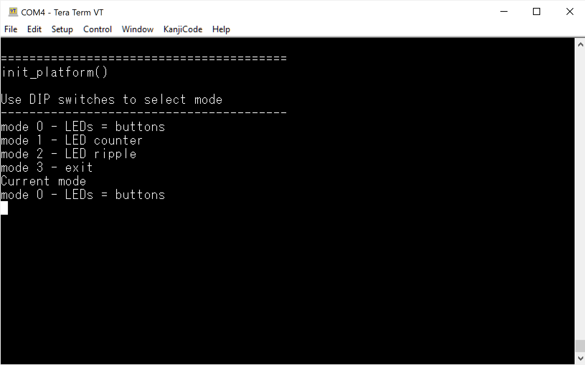

# PYNQ-Z2 FPGA and firmware demonstration project (firmware logic)

Built using the Xilinx toolchain/toolsuite.  
Should also be portable to other ZYNQ XC7Z020 compatible boards.  

## Purpose

What does it do?  
Wires up various switches, buttons and LEDs on the PYNQ-Z2 board (ZYNQ XC7Z020) using a firmware application.  
Demonstrates the basics of creating a project using scripting.  
The I/O connections are left open in the FPGA project and the firmware project does most of the work.

Start by reading the project [documentation](./docs/docs.md)

Once you have built the firmware and deployed it to the board, you can select the operation mode using the DIP switches as follows.

| **Dip Switches** | **Mode** | **Description**       |
|------------------|----------|-----------------------|
| down, down       | 0        | LEDs = push buttons   |
| down, up         | 1        | LED counter           |
| up, down         | 2        | LED ripple            |
| up, up           | 3        | Exits the application |

If you connect a [serial terminal](./docs/docs.md#firmware-project---connect-a-serial-terminal), you will also see some output.

If you're having issues setting up or running the project, you may want consider starting with [this project](https://github.com/mpab-fpga/pynq_z2_led_switcher) which has a more comprehensive walkthrough and no dependencies on firmware.
