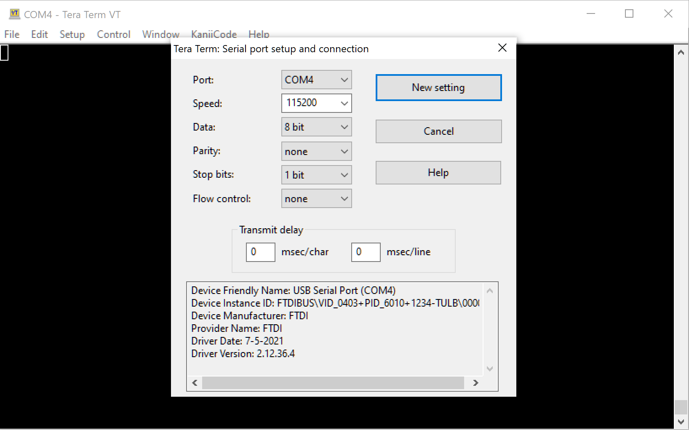

# Project Documentation

## Prerequisites

- Xilinx tool-suite
- PYNQ-Z2 board (or ZYNQ XC7Z020 compatible)

## Manifest

```code
pynq_z2_led_switcher_ps/
|-assets/ (fpga source files - merged when creating fpga, fpga board files)
|-docs/
|-firmware/ (Vitis workspace and projects)
  |-led_switcher_ps_app/
  |-led_switcher_ps_app_system/
  |-pynq_z2_pfm/
|-fpga/ (Vivado project)
|-clean.bat (nukes the fpga and firmware folders)
|-create.bat (creates the fpga and firmware projects, generates the hardware spec)
|-create-firmware.tcl (creates the firmware projects)
|-create-fpga.tcl (creates the fpga project)
|-generate-xsa.tcl (generates the hardware spec)
|-LICENSE
|-README.md
|-TODO.md
```

## Getting Started

### Checkout the project

```sh
> git clone ...
```

### Post checkout - Generate the fpga and firmware project files


- Windows: open a command prompt in the project root

  ```cmd
  >create.bat
  ```

- Windows Git Bash: open a shell prompt in the project root

- Linux: not yet tested

```sh
  > ./create.bat
  ```

**Note:** The above script

1. Creates a Vivado project
2. Generates hardware specifications for the FPGA and exports an xsa file
3. Generates a Vitis workspace

(This process will take a few minutes to complete)

### FPGA - post-generation fixes

None required

### Firmware - post-generation fixes

Open a Vitis workspace in ./firmware

- _pfm project
  - Update Hardware Specification
    - Navigate to FPGA xsa file
    - (relative paths work in scripts, not the IDE)
  - Build Project
- _application project: Build Project
- _sysproject
  - In Explorer, right click $NAME_app_system-> Create Boot Image
  - We need 3 boot image partitions
    - (bootloader): ./firmware/\$BOARD_pfm/export/\$BOARD_pfm/sw/\$BOARD_pfm/boot/fsb.elf
    - bitstream: ./fpga/fpga.runs/impl_1/\*.bit <-- **Important!** Use the fpga project bitstream to ensure changes stay in synch
    - \$APP.elf: ./firmware/\$APP_app/Debug/\$APP_app.elf
  - -> Create Image

## Notes

The Firmware project supports creating a BOOT.bin image to run standalone off of an SD card

The TUL PYNQ-Z2 board file is included to make this project as self-contained as possible

<https://dpoauwgwqsy2x.cloudfront.net/Download/pynq-z2.zip>

## FPGA Project

## FPGA Project - Design cribbed from [here](https://discuss.pynq.io/t/tutorial-creating-a-hardware-design-for-pynq/145)


### FPGA Project - Summary

- Create a new project (RTL, do not specify sources, board: pynq-z2)
- Create Block Design
  - Add Zynq7 IP
    - wire FCLCK_CLK0 to M_AXI_GP0_ACLK
  - GPIO components
    - add 1 AXI BRAM controller, rename to bram
    - add 3 AXI GPIO controllers, rename to buttons, leds, switches
  - Run Connection Automation (Important! follow this pattern)
    - buttons -> btns_4bits
    - leds -> leds_4bits
    - switches -> sws_2bits


- Create HDL Wrapper
- Generate Bitstream
- File->Project->Write TCL (Copy sources, Recreate Block designs)
- File->Export->Export Hardware

## Firmware Project

## Firmware Project - C Application

The application has four modes (states), selected by the DIP switches

| **Dip Switches** | **Mode** | **Description**       |
|------------------|----------|-----------------------|
| down, down       | 0        | LEDs = push buttons   |
| down, up         | 1        | LED counter           |
| up, down         | 2        | LED ripple            |
| up, up           | 3        | Exits the application |

### Firmware Project - Connect a Serial Terminal

- Window->Show View->Vitis->Vitis Serial Terminal
- Select '+' button in terminal and configure COM port
- Serial port config
  - 115200
  - 8 bit
  - no parity
  - 1 stop bit
  - no flow control
- or use Tera Term



## Firmware Project - Python Application (TODO...)

[Python Sample 1](./python/tutorial_1.py)

```python
import time
from pynq import Overlay
tutorial = Overlay("./design_1.bit")
bram = tutorial.bram
buttons = tutorial.buttons
switches = tutorial.switches
leds = tutorial.leds
outputMask = 0x0
tristateRegisterOffset = 0x4
leds.write(tristateRegisterOffset, outputMask)
dataRegisterOffset = 0x0
led_pattern = 0xa
print("press a button to light an LED")
print("toggle a switch to stop")
while(not switches.read()):
    leds.write(dataRegisterOffset, buttons.read())
```

## References

<https://discuss.pynq.io/t/tutorial-creating-a-hardware-design-for-pynq/145>

<https://discuss.pynq.io/t/tutorial-using-a-new-hardware-design-with-pynq-axi-gpio/146>

<https://digilent.com/reference/programmable-logic/guides/vitis-create-blinky-software>

<https://forum.digilent.com/topic/20577-arty-a7-basic-io-problem/>

<https://digilent.com/reference/programmable-logic/guides/getting-started-with-ipi?redirect=1#create_a_main_c_source_to_control_axi_gpio_peripherals>

<https://www.avnet.com/opasdata/d120001/medias/docus/3/SILICA_Xilinx_Zynq_ZedBoard_Vivado_Workshop_ver1.0.pdf>
